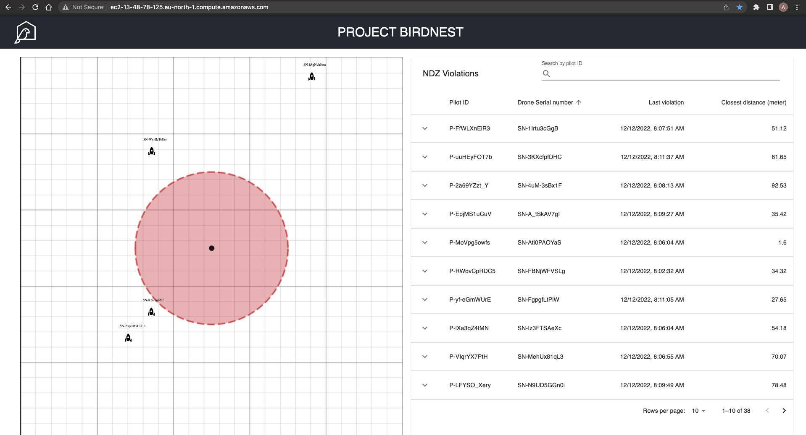
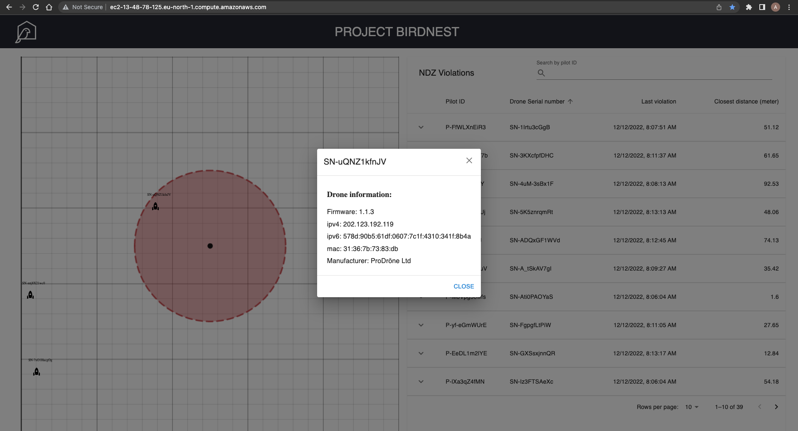
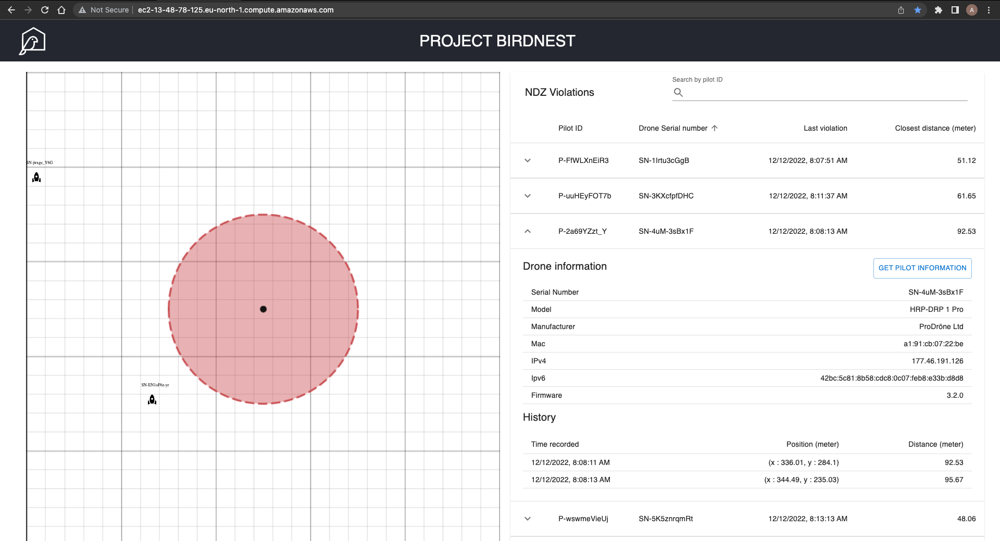

<h1> PROJECT BIRDNEST </h1>

[The link to the web app: Project Birdnest](http://ec2-13-48-78-125.eu-north-1.compute.amazonaws.com/)

<h2>Objective</h2>

- Persist the pilot information for 10 minutes since their drone was last seen by the equipment
- Display the closest confirmed distance to the nest
- Contain the pilot name, email address and phone number
- Immediately show the information from the last 10 minutes to anyone opening the application
- Not require the user to manually refresh the view to see up-to-date information

<h2>Side-note</h2>

- The web app uses web socket with socket.io for real-time responses.
- You can click on the drone with the rocket icon to show more information about the drone.
- The pilot information of the NDZ violating drone can be access by expand the table row on the right by the arrow button and click on "GET PILOT INFORMATION" button.

<h2>API endpoint list</h2>

Base url: [http://ec2-13-48-78-125.eu-north-1.compute.amazonaws.com/](http://ec2-13-48-78-125.eu-north-1.compute.amazonaws.com/)

| Endpoints      | Description |
| -------------- | ----------- |
| GET api/drones/all | Response with JSON of all the drones' information and coordinate log.|
| GET api/drones/:id  | Response with JSON of the information and coordinate log of the drone with given id, 404 if the drone id cannot be found in the run-time data.|
| GET api/drones/ndz  | Response with JSON of the information and coordinate log of the drone violating the NDZ|
| GET api/pilot/:id  | Response with JSON of the information of the pilot of the drone with the given id violating the NDZ, 404, the drone id cannot be found in the run-time data and 403 if the drone didn't violate the NDZ. |

<h2>Screenshots</h2>

Initial state:

Click on drone on the map (the rocket icons):

Expanded row item in the table:

